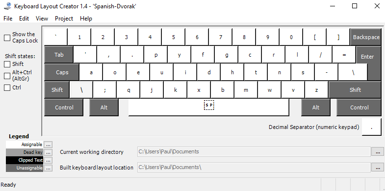
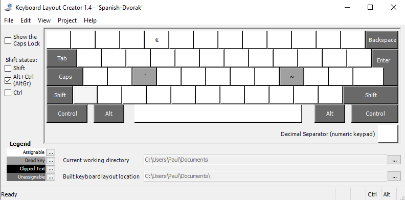

# Improved Spanish Dvorak keyboard layout for Windows

This layout is based off the standard United States - Dvorak layout, introducing some changes to make it useful for typing in Spanish and is inspired by the OSX Dvorak layout. It only adds new keys (mostly accents) and doesn't change any of the existing keys.

## Changes introduced

```
Accents:
AltGr + e = ´ (dead key)
AltGr + e a = á
AltGr + e o = ó
AltGr + e e = é
AltGr + e u = ú
AltGr + e i = í
AltGr + e <space> = ´

AltGr + n = ~ (dead key)
AltGr + n n = ñ
AltGr + n <space> = ~

AltGr + 4 = €
```

## Layout
### Default state


### Alt Gr


Created using Microsoft Keyboard Layout Creator 1.4.

